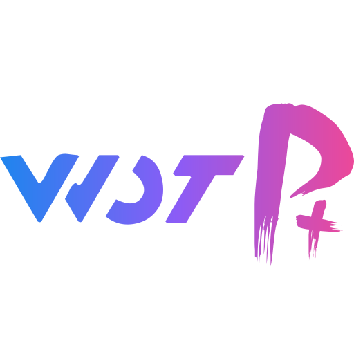

    

<h1 align="center">Wot UI Plus</h1>

简体中文

📱 一个基于vue3+Typescript构建，参照<a href="https://github.com/jd-ftf/wot-design-mini?tab=readme-ov-file">wot-design</a>打造的uni-app组件库

  🚀 <a href="https://l-spaces.github.io/wot-ui-plus-docs" target="_blank">文档网站</a>&nbsp;
  📦 <a href="https://www.npmjs.com/package/wot-ui-plus" target="_blank">npm 包</a>&nbsp;
  🔗 <a href="https://github.com/l-spaces/wot-ui-plus" target="_blank">Git 仓库</a>&nbsp;

## ✨ 特性

- 🎯 多平台覆盖，支持 微信小程序、支付宝小程序、钉钉小程序、H5、APP 等.
- 🚀 88+ 个高质量组件，覆盖移动端主流场景.
- 💪 使用 Typescript 构建，提供良好的组件类型系统.
- 🌍 支持国际化，内置 15 种语言包.
- 📖 提供丰富的文档和组件示例.
- 🎨 支持修改 CSS 变量实现主题定制.
- 🍭 支持暗黑模式.

## 📱 预览

## 快速上手

详细说明见 [快速上手]()。

## 链接

- [常见问题]()
- [更新日志]()

## 捐赠

如果您觉得 wot-ui-plus 对您有帮助，欢迎捐赠支持。您的捐赠将帮助我们继续维护和完善 wot-ui-plus。

## 鸣谢

- [wot-design](https://github.com/jd-ftf/wot-design-mini) - 感谢 wot-design 团队多年来的不断维护。
- [wot-design-uni](https://github.com/Moonofweisheng/wot-design-uni) - 感谢 wot-design-uni 让 wot-ui-plus 能够站在巨人的肩膀上。
- [uni-helper](https://github.com/uni-helper) - 感谢 uni-helper 团队提供的 uni-app 工具库，让 wot-ui-plus 能够更方便地使用。

## 开源协议

本项目基于 [MIT](https://zh.wikipedia.org/wiki/MIT%E8%A8%B1%E5%8F%AF%E8%AD%89) 协议，请自由地享受和参与开源。
